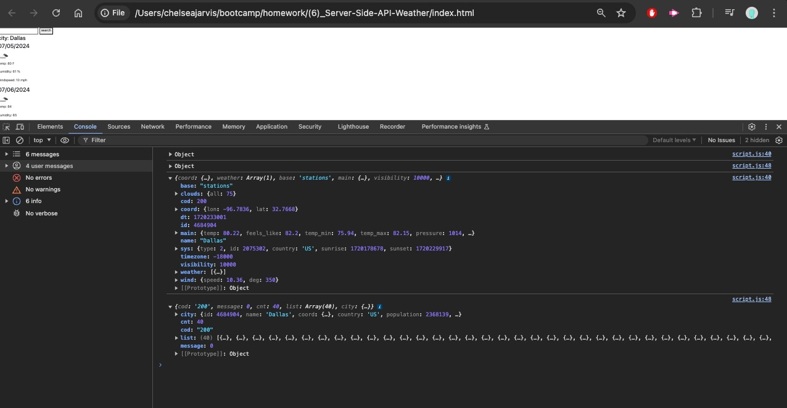
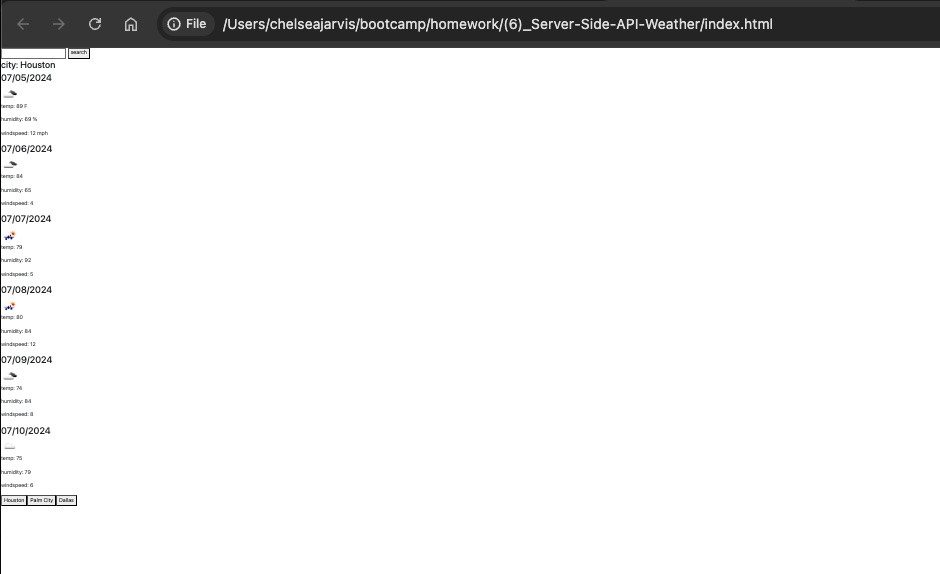

# Weather Dashboard 
  
  ## Description  ✏️
  
  This weather dashboard uses a server-side API to get the current and upcoming weather from multiple cities.
  
  ## Table of Contents 📖

  [Usage](#usage)

  [Credits](#credits)

  [License](#license)

  [Questions](#questions)
  

  ## Usage 

HTML, Bootstrap, JavaScript

  ### Deployed Link
  

### Screenshots

______________________________________________________________________________

## Credits 

https://github.com/Jarvisismy-copilot

## License

None.

 ## Questions 
  
 If you have any questions about the repo or notice any bugs you want to report, open an issue or contact me directly at chelseajarvis3301@icloud.com. 
  
  